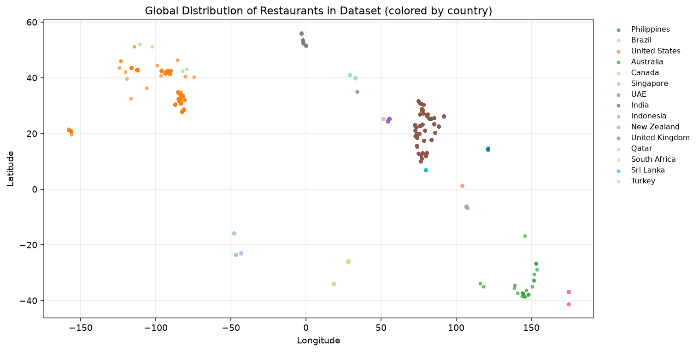
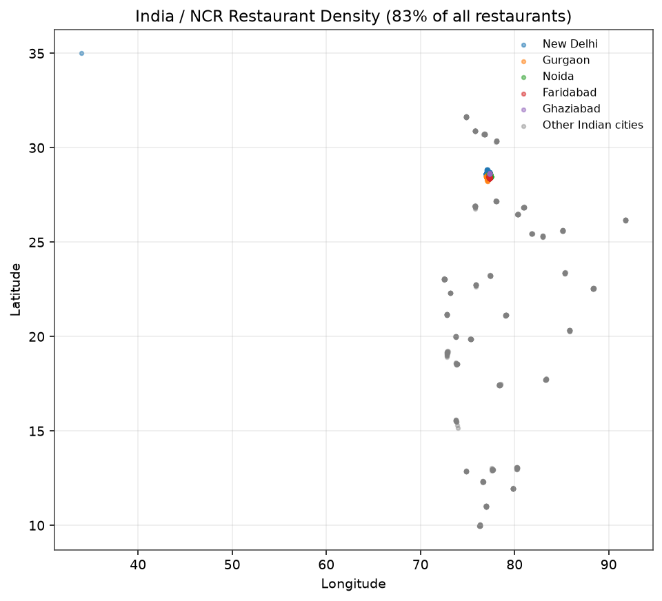
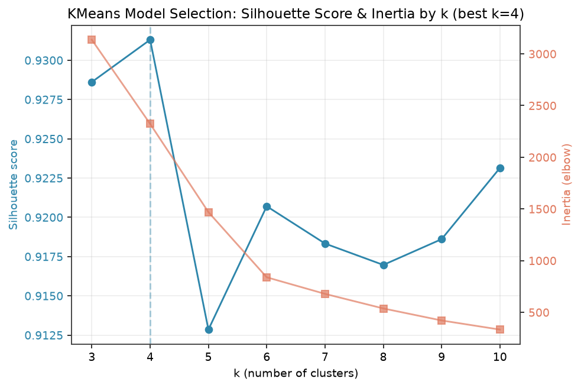
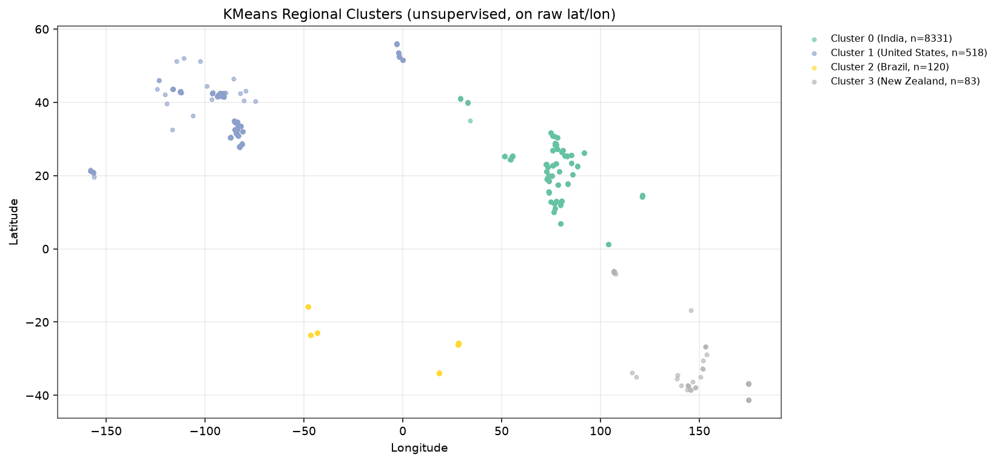
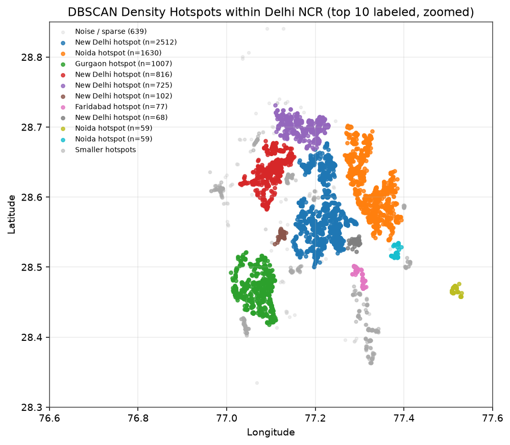
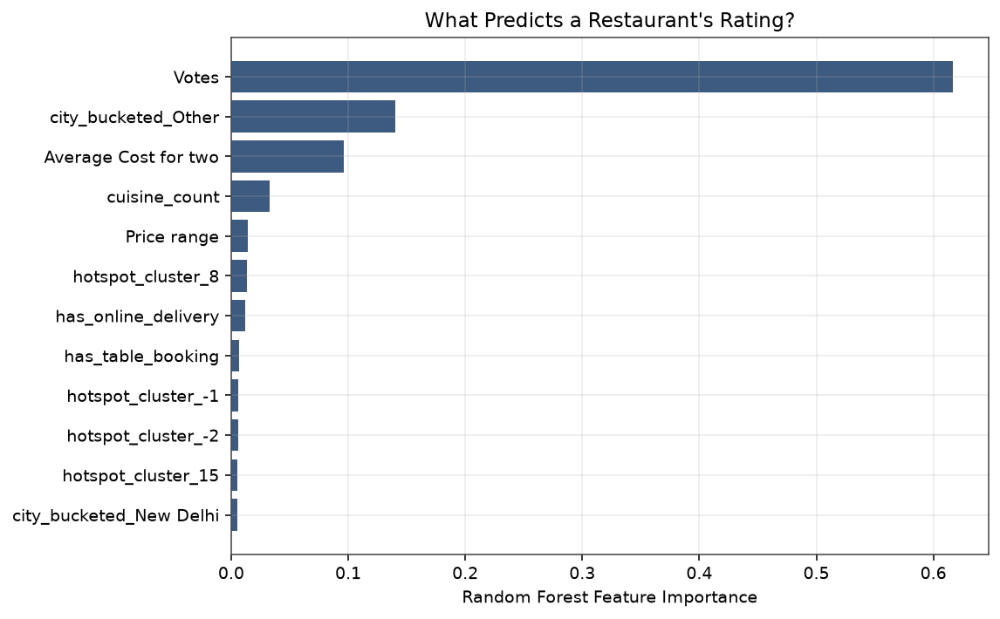
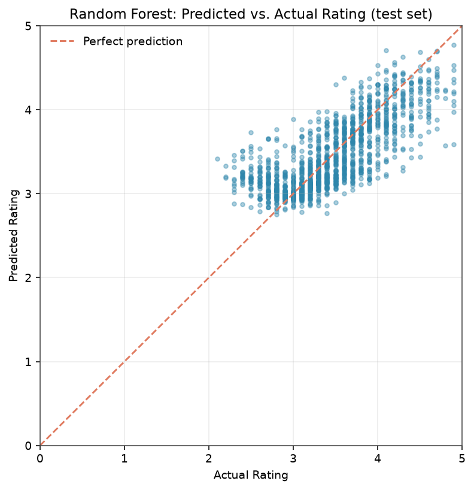
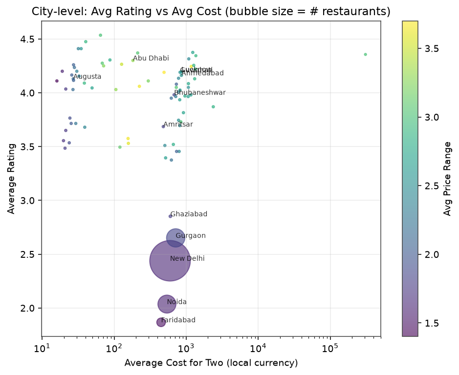

[](https://codespaces.new/naikmayanka04/Restaurant-Location-Analysis)
# Restaurant Location Analysis (ML)

A geographic analysis of 9,551 restaurants combining exploratory data
analysis with two machine learning techniques: **unsupervised clustering**
to discover restaurant hotspots directly from coordinates, and a
**supervised regression model** to predict restaurant ratings and quantify
what actually drives them.

**[Read the full HTML report](reports/restaurant_location_analysis.html)** (download and open in a browser, or host via GitHub Pages — see below).

## Machine learning approach

| Task | Technique | Why |
|---|---|---|
| Discover regional groupings | **KMeans** (scikit-learn), k selected via **silhouette score** across k=3–10 | Unsupervised — no city labels used, purely geometric |
| Discover fine-grained hotspots within India | **DBSCAN** (density-based) | Finds arbitrary-shaped, variable-density clusters and explicitly flags sparse restaurants as noise, which KMeans can't do |
| Predict `Aggregate rating` | **Random Forest Regressor** vs. **Linear Regression** baseline | Proper 80/20 train/test split, MAE/RMSE/R² evaluation, feature importance |

### Clustering results

- **KMeans** on all 9,052 geolocated restaurants: silhouette score peaks at
  **k=4**, and those 4 clusters align almost exactly with country
  boundaries — a sanity check that the geometry-only clustering is picking
  up real structure.
- **DBSCAN** within India (eps ≈ 1 km, min_samples=8) found **32 dense
  hotspots** among 8,156 restaurants; 7.8% are sparse outliers not part of
  any hotspot. The single largest hotspot (2,512 restaurants, centered on
  Connaught Place, New Delhi) rates 2.85 on average — but a much smaller
  102-restaurant hotspot near the airport (Mahipalpur) rates just **1.43**,
  the worst of any hotspot found. A city-level average would completely
  hide this.

### Rating prediction results

| Model | Test MAE | Test RMSE | Test R² |
|---|---|---|---|
| Linear Regression | 0.312 | 0.400 | 0.484 |
| **Random Forest** | **0.265** | **0.354** | **0.596** |

Trained on 7,403 rated restaurants (2,148 "Not rated" rows excluded, since
a rating of 0 means "unrated," not "bad"), using votes, cost, price range,
cuisine count, delivery/booking flags, bucketed city, and the DBSCAN
hotspot cluster as features.

**Key finding:** `Votes` alone accounts for ~62% of the Random Forest's
feature importance — far more than location, cost, or cuisine combined.
Geography explains *where* restaurants cluster and helps flag specific
problem neighborhoods (like Mahipalpur above), but it's a weak predictor of
rating *quality* on its own; popularity/review volume dominates.

## Other EDA findings

- 90.6% of restaurants are in India; 83.2% of the *entire dataset* is just
  five Delhi NCR cities (New Delhi, Gurgaon, Noida, Faridabad, Ghaziabad).
- Every non-India country contributes a flat ~20-restaurant sample —
  consistent with a deep India/NCR dataset plus a shallow benchmark layer.
- Cuisine diversity scales with restaurant density, not geography.
- Online delivery adoption ranges from 0% to 52% across Indian cities alone.
- 499 rows (5.2%) have placeholder (0,0) coordinates and are excluded from
  all geographic analysis.

## Charts

| | |
|---|---|
|  |  |
|  |  |
|  |  |
|  |  |

## Project structure

```
.
├── data/
│   └── Restaurant_Dataset.xlsx         # source data
├── src/
│   ├── constants.py                    # country-code map, NCR city list, paths
│   ├── load_data.py                    # load + clean the Excel file
│   ├── analysis.py                     # EDA: city-level stats, cuisine counts
│   ├── clustering.py                   # ML: KMeans + DBSCAN hotspot detection
│   ├── predict_rating.py               # ML: rating prediction (RF vs Linear Reg)
│   ├── charts.py                       # all chart generation, incl. ML charts
│   └── generate_report.py              # assembles the standalone HTML report
├── outputs/                            # generated CSVs (stats, clusters, model results)
├── images/                             # generated chart PNGs
├── reports/
│   └── restaurant_location_analysis.html   # final report (generated)
├── run_all.py                          # runs the full pipeline in one command
├── requirements.txt
└── README.md
```

## Usage

```bash
python -m venv .venv && source .venv/bin/activate   # optional
pip install -r requirements.txt
python run_all.py
```

This runs the full pipeline in order — EDA → clustering → rating
prediction → charts → report — and writes everything to `outputs/`,
`images/`, and `reports/`. Each step can also be run individually:

```bash
python src/analysis.py         # EDA summary stats -> outputs/city_stats.csv
python src/clustering.py       # KMeans + DBSCAN -> outputs/*clusters*.csv, *hotspots*.csv
python src/predict_rating.py   # trains models -> outputs/model_comparison.csv, feature_importances.csv
python src/charts.py           # all PNGs -> images/
python src/generate_report.py  # final report -> reports/restaurant_location_analysis.html
```

## Dataset

`data/Restaurant_Dataset.xlsx` — 9,551 restaurants across 15 countries, with
columns including `Latitude`, `Longitude`, `City`, `Locality`,
`Country Code`, `Cuisines`, `Aggregate rating`, `Votes`,
`Average Cost for two`, `Price range`, `Has Online delivery`, and
`Has Table booking`.

## Publishing the report on GitHub Pages (optional)

1. Push this repo to GitHub.
2. In **Settings → Pages**, set the source to the `main` branch and the
   `/reports` folder (or copy the HTML file to `docs/index.html` and point
   Pages at `/docs`).
3. GitHub will publish it at `https://<username>.github.io/<repo>/`.
